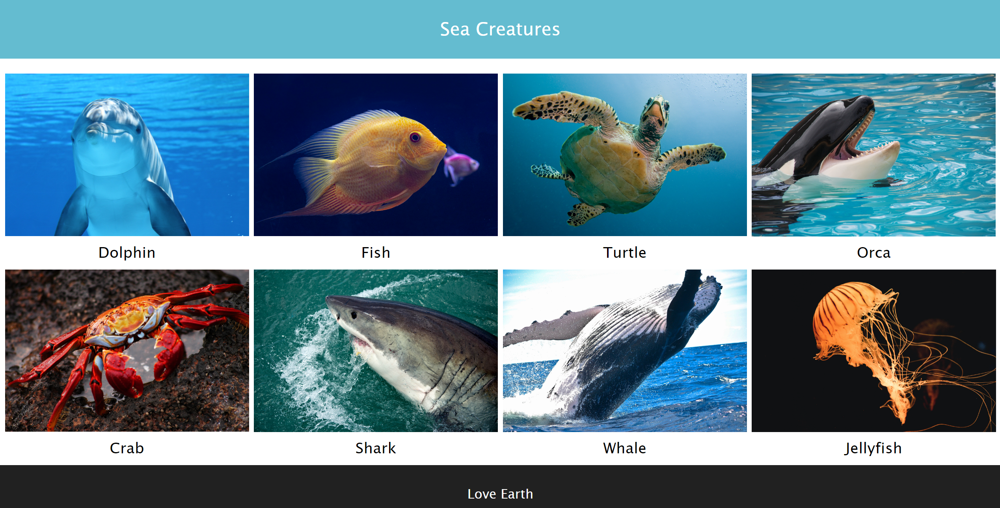

# Responsive image gallery exercise

This is another exercise from Factoria F5 bootcamp. The goal is to build a simple image gallery. It should be responsive and have 3 media queries: mobile, tablet and desktoop.

## GitHub Pages Link

https://markwebdeveloper.github.io/Responsive-Image-Gallery/

## Screenshots

## Dev Dependencies

- Vite [https://vitejs.dev/]
- Sass [https://sass-lang.com/] 
- Scss-Reset [https://www.npmjs.com/package/scss-reset]
- Typescript [https://www.typescriptlang.org/]

## Install

npm install
npm run dev

## Production

npm run build

### Thank you!